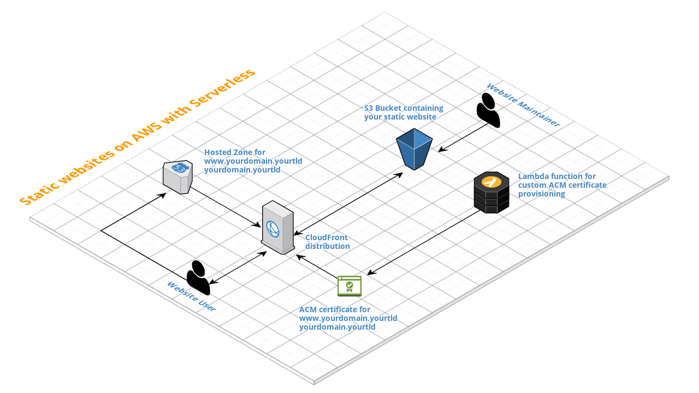

# serverless-aws-static-websites
Host your static website on AWS via S3, with global CDN via CloudFront, using SSL certificates provided by ACM using your own domain name!

All set up via one [Serverless](https://www.serverless.com) command and minimum manual configuration!

## Architecture

[]()

### What is provisioned in your AWS account?
* A S3 bucket containing your static website
* A CloudFront distribution for global hosting via CDN
* A HostedZone on Route53 with A records for your domain name
* A Lambda function for automatic SSL certificate generation via ACM for your domain name (run once upon deployment)

## Preconditions
This guide assumes that you have a pre-existing domain which you want to use for hosting your static website. Furthermore, you need to have access to the domain's DNS configuration.

Also, you need to have an install of [Serverless](https://www.serverless.com) on your machine.

## How-to
To use this blueprint with your own static websites, you can follow the steps below to get started.

### Set up a Serverless project for your static website
There are basically two ways to get started, either use [Serverless](https://www.serverless.com) to generate a basic project structure, or use the "traditional" fork and clone mechanisms.

#### Use Serverless templates
The following command will create a local project structure you can use to deploy your static website in the `mystaticwebsite` folder relative to your current working directory:

```bash
$ sls create --template-url https://github.com/tobilg/serverless-aws-static-websites --path mystaticwebsite
Serverless: Generating boilerplate...
Serverless: Downloading and installing "serverless-aws-static-websites"...
Serverless: Successfully installed "serverless-aws-static-websites"
```

**Hint**  
When using this method, Serverless is replacing the `service.name` in the `serverless.yml` file automatically with `mystaticwebiste`. If you want to use a different stack name, you have to replace it manually. You also need to take care of that the stack name is using only allowed characters. When using the "Fork and clone" method below, the stack name is automatically derived from the domain name and sanitized regarding the allowed characters.

#### Fork and clone
Once you forked the repo on GitHub, you can clone it locally via

```bash
$ git clone git@github.com:youraccount/yourrepo.git
```

where `youraccount/yourrepo` needs to be replaced with the actual repository name of your forked repo.

### Install dependencies
To install the dependencies, do a 

```bash
$ npm i
```

After that, the project is usable.

### Create your static website
You can now create your static website in the `src` folder of your cloned repo.

### Deploy
You can deploy your static website with the following command:

```bash
$ sls deploy --domain yourdomain.yourtld
```

where `yourdomain.yourtld` needs to be replaced with your actual domain name. You can also specify a AWS region via the `--region` flag, otherwise `us-east-1` will be used.

#### Manual update of DNS records on first deploy
On the first deploy, it is necessary to update the DNS setting for the domain manually, otherwise the hosted zone will not be able to be established.

Therefore, once you triggered the `sls deploy` command, you need to log into the AWS console, go to the [Hosted Zones](https://console.aws.amazon.com/route53/home?region=eu-central-1#hosted-zones:) menu and select the corresponding domain name you used for the deployment.

The nameservers you have to configure your domain DNS to can be found under the `NS` record and will look similar to this:

```bash
ns-1807.awsdns-33.co.uk.
ns-977.awsdns-58.net.
ns-1351.awsdns-40.org.
ns-32.awsdns-04.com.
```

You should then update your DNS settings for your domain with those values, **otherwise the stack creation process will fail**.

This is a bit misfortunate, but to the best of knowledge there's currently no other way possible if you use AWS external (non-Route53) domains. During my tests with [namecheap.com](https://www.namecheap.com) domains the DNS records were always updated fast enough, so that the stack creation didn't fail.

#### Deployment process duration
As a new CloudFront distribution is created (which is pretty slow), it can take **up to 45min** for the initial deploy to finish. This is normal and expected behavior.

### Post-deploy
If the deployment finished successfully, you will be able to access your domain via `https://www.yourdomain.yourtld` and `https://yourdomain.yourtld`.

This setup should give you some good [PageSpeed Insights](https://developers.google.com/speed/pagespeed/insights/?hl=en) results.

### Updates
For every update of your website, you can trigger a deploy as stated above. This will effectively just do s S3 sync of the `src` folder. 

To do a manual sync, your can also use `sls s3sync`. There's also the possibility to customize the caching behavior for individual files or file types via the `serverless.yml`, see the [s3sync plugin's documentation](https://www.npmjs.com/package/serverless-s3-sync#setup).

As **CloudFront caches the contents of the website**, a [Serverless plugin](https://github.com/aghadiry/serverless-cloudfront-invalidate) is used to invalidate files. This [may incur costs](https://docs.aws.amazon.com/AmazonCloudFront/latest/DeveloperGuide/Invalidation.html#PayingForInvalidation), see the [docs](https://aws.amazon.com/de/premiumsupport/knowledge-center/cloudfront-serving-outdated-content-s3/) for more info. 

You can run `sls cloudfrontInvalidate` to do a standalone invalidation of the defined files in the `serverless.yml`.

## Removal
If you want to remove the created stack, you will have to delete all records of the Hosted Zone of the respective domain except the `SOA` and `NS` records, otherwise the stack deletion via

```bash
$ sls remove --domain yourdomain.yourtld
```

will fail.
